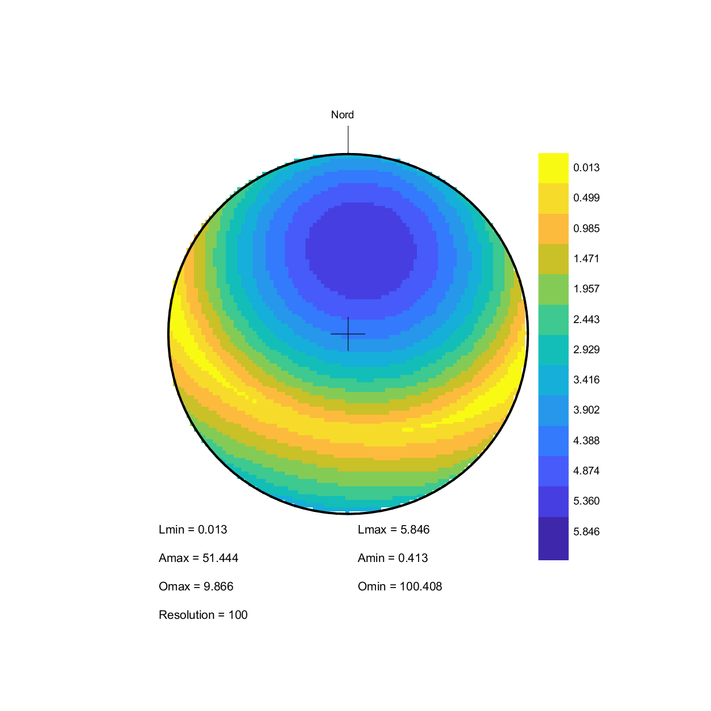

# Lambda

This projet was realized during two mandatory civil services for the RISK group of the the institute of earth sciences (ISTE) of Lausanne University (UNIL) in 2021 and 2022.

The goal of this project was to port a software made in 1996, coded in Visual Basic by Prof. Michel Jaboyedoff for vizualizing spatial distribution of discontinuities used in the following paper to a MATLAB.
> Jaboyedoff, Michel. (1996). Distribution spatiale des discontinuites dans une falaise Approche statistique et probabiliste. 

# This repo contains the code packaged in:
1. A Matlab application
2. A Executable (matlab runtime required)
3. An installer

# Exemple

